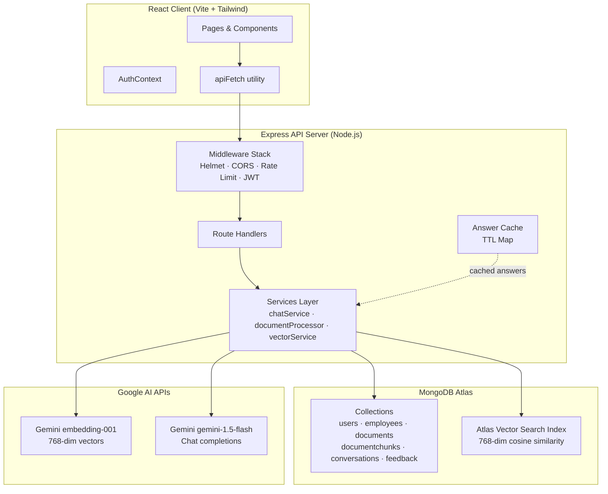
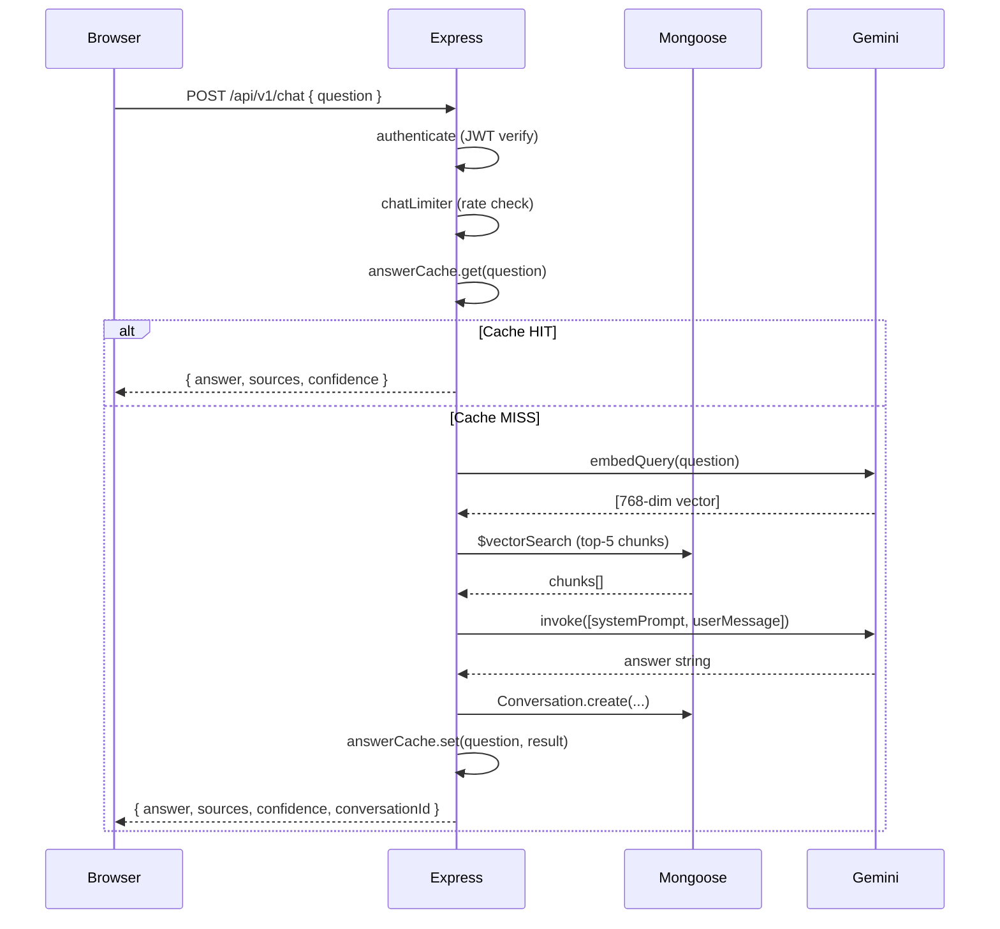

# Architecture Overview

## System Architecture



## Request Lifecycle



## Folder Architecture

```
staffsync/
├── client/          React SPA
│   └── src/
│       ├── components/   Reusable UI components
│       ├── config/       Client-side constants
│       ├── context/      React Context (Auth)
│       ├── hooks/        Custom React hooks
│       ├── pages/        Route-level page components
│       └── utils/        API helper, formatters
│
├── server/          Express REST API
│   ├── config/      Server constants (no magic numbers)
│   ├── db/          Mongoose connection
│   ├── middleware/  Auth, validation, upload, rate limiting
│   ├── models/      Mongoose schemas
│   ├── routes/      Express route handlers
│   ├── services/    Business logic (AI, cache, vector)
│   └── utils/       Logger, regex escape
│
└── docs/            Architecture & API documentation
```

## Technology Decisions

| Decision | Rationale |
|---|---|
| MongoDB Atlas | Native Vector Search avoids a separate vector DB |
| Gemini `embedding-001` | 768-dim, fast, free tier available |
| LangChain.js | Abstracts embeddings/chat model, easy to swap providers |
| Express modular routes | One file per resource — easy to locate and maintain |
| In-process TTL cache | Avoids Redis dependency for a single-server deployment |
| Fire-and-forget indexing | HTTP response never blocked by slow PDF processing |
| `select: false` on password | Defence-in-depth — password never leaks through query results |
