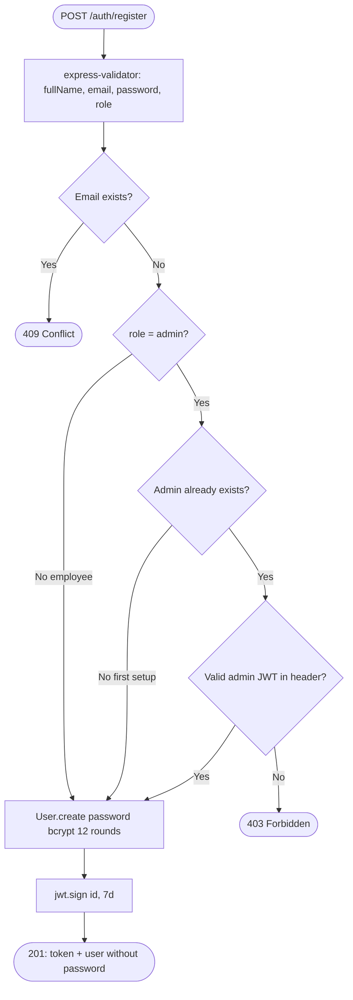
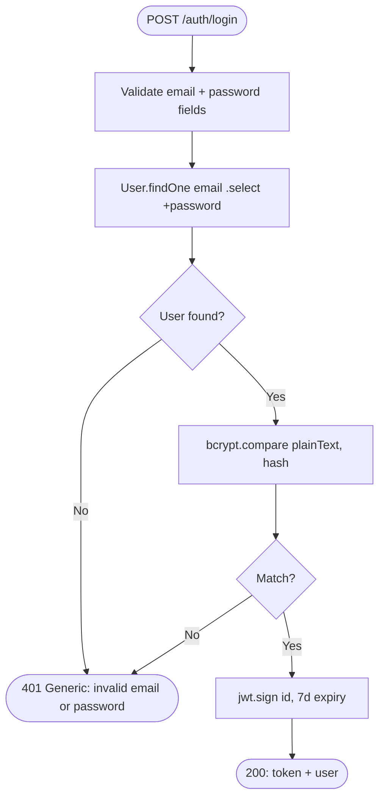
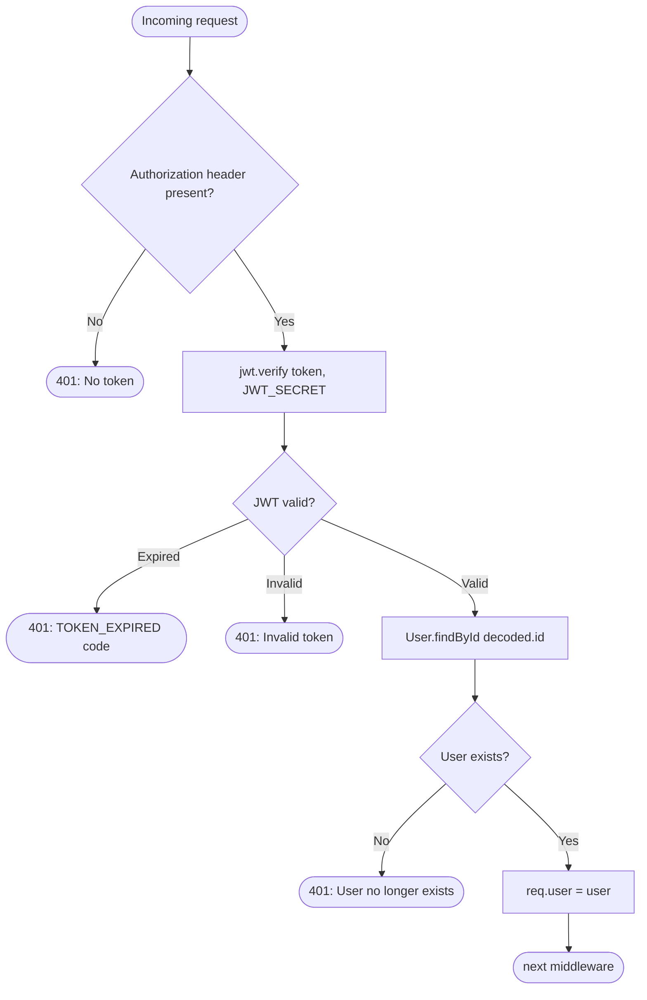
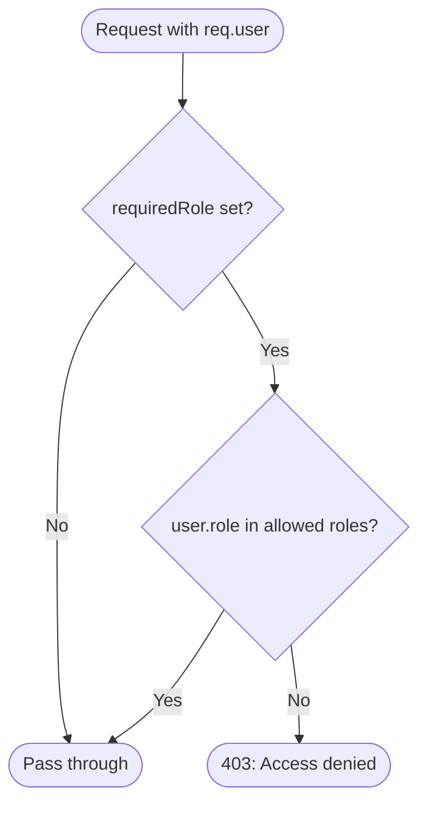
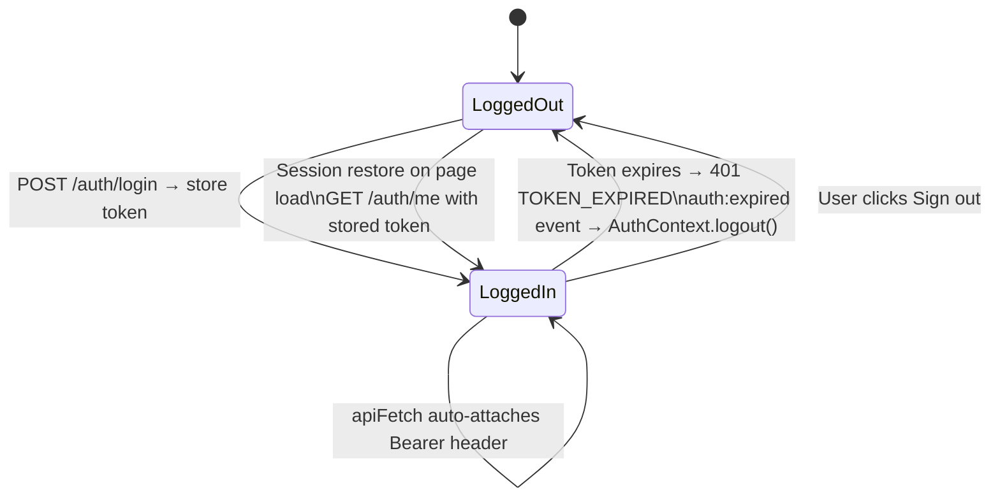

# Authentication & Authorisation Flow

## Registration

## Login

## Request Authentication

## Role Authorisation

## Client Token Lifecycle

## Security Measures

| Concern | Mitigation |
|---|---|
| Password storage | bcrypt with cost factor 12 |
| Password exposure | `select: false` + `toJSON` transform strip `password` |
| Token forgery | RS256-equivalent HMAC via `JWT_SECRET` |
| Token replay after logout | Short-lived tokens (7d); revocation via future blocklist |
| Brute force login | `authLimiter`: 10 requests / 15 min per IP |
| Admin self-registration | Blocked if any admin exists — requires existing admin JWT |
| CSRF | Not applicable — token-based auth, no cookies |
| XSS → token theft | `localStorage` — acceptable for this architecture; migrate to `httpOnly` cookies for hardened production |
| Injection | All user input validated + sanitised via express-validator |
