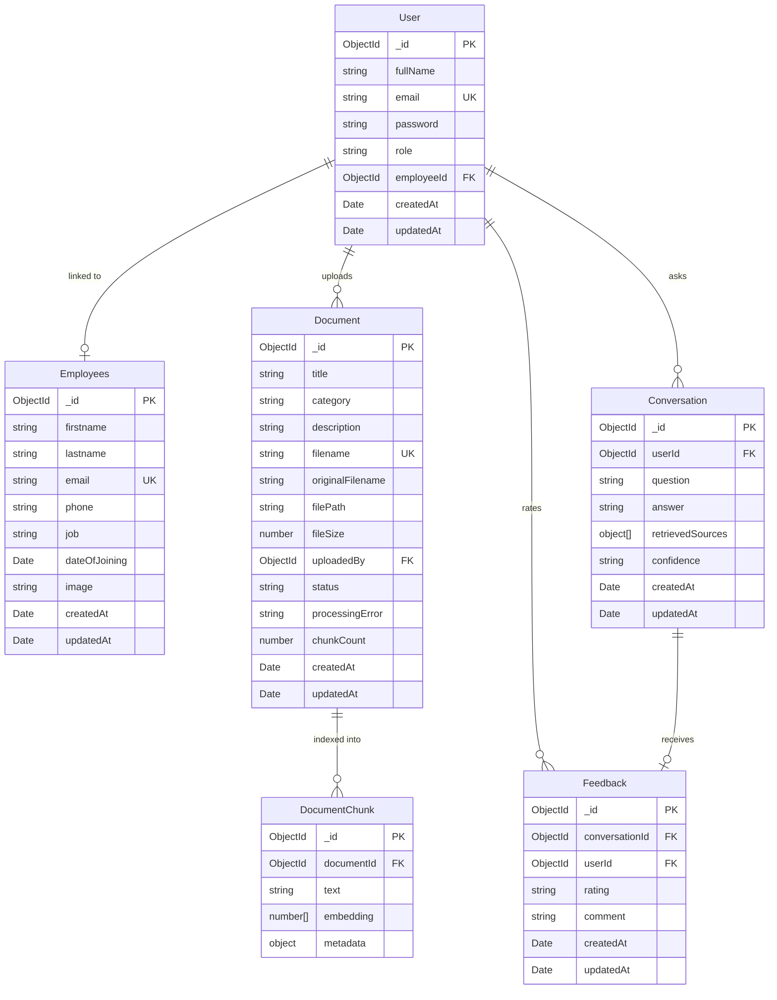
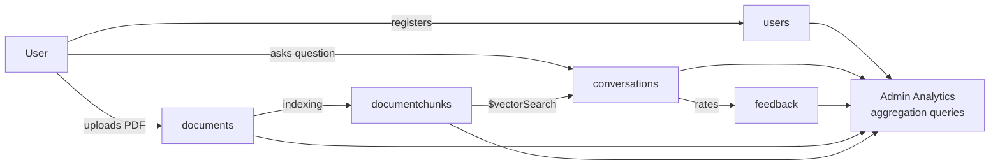

# Database Design

## Collections Overview



## Schema Details

### `users`
| Field | Type | Constraints |
|---|---|---|
| `fullName` | String | required, max 100 |
| `email` | String | required, unique, lowercase |
| `password` | String | required, min 8, `select: false` |
| `role` | String | enum: `admin\|employee`, default `employee` |
| `employeeId` | ObjectId → Employees | optional, nullable |

**Indexes:** unique on `email`

---

### `employees`
| Field | Type | Constraints |
|---|---|---|
| `firstname` | String | required, max 50 |
| `lastname` | String | required, max 50 |
| `email` | String | required, unique |
| `phone` | String | required |
| `job` | String | required, max 100 |
| `dateOfJoining` | Date | required |
| `image` | String | required (URL) |

**Indexes:** unique on `email`

---

### `documents`
| Field | Type | Constraints |
|---|---|---|
| `title` | String | required, max 200 |
| `category` | String | enum: 10 HR categories |
| `description` | String | optional, max 1000 |
| `filename` | String | required, unique (UUID-based) |
| `originalFilename` | String | required |
| `filePath` | String | required (S3 object key) |
| `fileSize` | Number | required, bytes |
| `uploadedBy` | ObjectId → User | required |
| `status` | String | enum: `processing\|ready\|failed\|archived` |
| `processingError` | String | nullable |
| `chunkCount` | Number | set after indexing |

**Indexes:** unique on `filename`, text index on `title + description + category`

---

### `documentchunks`
| Field | Type | Constraints |
|---|---|---|
| `documentId` | ObjectId → Document | required, indexed |
| `text` | String | required (≤800 chars) |
| `embedding` | [Number] | required, 768 floats |
| `metadata.title` | String | denormalised |
| `metadata.category` | String | denormalised, filter field |
| `metadata.pageNumber` | Number | 0 (placeholder) |
| `metadata.chunkIndex` | Number | position in document |
| `metadata.uploadedBy` | ObjectId | denormalised |
| `metadata.uploadDate` | Date | denormalised |

**Indexes:** `documentId` (standard), `embedding` (Atlas Vector Search — cosine, 768-dim)

**Atlas Vector Search Index JSON:**
```json
{
  "name": "document_vector_index",
  "type": "vectorSearch",
  "fields": [
    { "type": "vector", "path": "embedding", "numDimensions": 768, "similarity": "cosine" },
    { "type": "filter", "path": "metadata.category" },
    { "type": "filter", "path": "documentId" }
  ]
}
```

---

### `conversations`
| Field | Type | Constraints |
|---|---|---|
| `userId` | ObjectId → User | required, indexed |
| `question` | String | required, max 1000 |
| `answer` | String | required |
| `retrievedSources` | Array | `[{ document, category, chunkIndex, score }]` |
| `confidence` | String | enum: `high\|medium\|low` |

**Indexes:** compound `{ userId: 1, createdAt: -1 }` for history listing

---

### `feedback`
| Field | Type | Constraints |
|---|---|---|
| `conversationId` | ObjectId → Conversation | required |
| `userId` | ObjectId → User | required |
| `rating` | String | enum: `helpful\|not_helpful` |
| `comment` | String | optional, max 500 |

**Indexes:** unique compound `{ conversationId: 1, userId: 1 }` — prevents double-voting

## Data Flow Diagram


