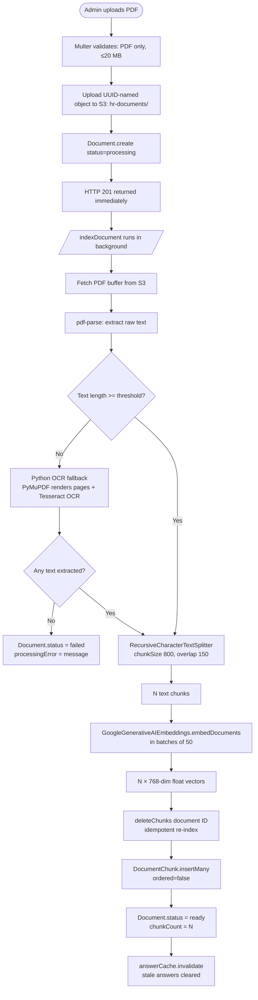
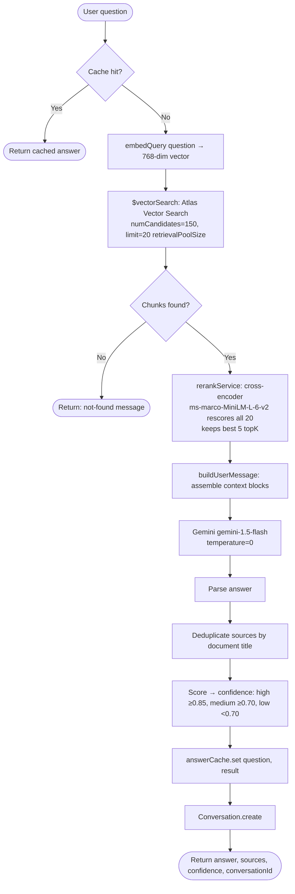

# RAG Pipeline — Detailed Flow

## Upload & Indexing Pipeline



## Chunking Strategy

| Parameter | Value | Rationale |
|---|---|---|
| `chunkSize` | 800 chars | Fits in Gemini context with room for multiple chunks + question |
| `chunkOverlap` | 150 chars | Prevents answers from being split across chunk boundaries |
| Splitter | `RecursiveCharacterTextSplitter` | Respects paragraph/sentence structure before character splitting |

## Embedding Model

- **Model:** `models/embedding-001`
- **Dimensions:** 768
- **Similarity metric:** cosine
- **Batch size:** 50 chunks per API call (Gemini limit: 100)
- **Rate limiting:** 200 ms sleep between batches

## Metadata Stored Per Chunk

```json
{
  "documentId": "ObjectId",
  "text": "raw chunk text (≤800 chars)",
  "embedding": [0.01, -0.23, ...],
  "metadata": {
    "title": "Leave Policy 2024",
    "category": "Leave Policy",
    "pageNumber": 0,
    "chunkIndex": 4,
    "uploadedBy": "ObjectId",
    "uploadDate": "2024-01-15T..."
  }
}
```

> `pageNumber` is 0 for all chunks because `pdf-parse` strips page boundaries in the text output. Per-page tracking would require a more advanced PDF parser.

## Text Extraction & OCR Fallback

Most PDFs have a real text layer, so `pdf-parse` (Node) handles them directly. Scanned/photographed PDFs have no text layer — just page images — so `pdf-parse` returns little or no text for them.

If the extracted text is shorter than `config.ocrMinTextLength` (default 20 chars), `documentProcessor.js` falls back to a small Python OCR script (`scripts/ocr/ocr_pdf.py`): it rasterises each page with PyMuPDF and runs Tesseract OCR on the page images. Node invokes it as a child process via `utils/ocrService.js` and reads back the OCR’d text. Everything after that point — chunking, embeddings, vector storage, chat, reranking — is unchanged; OCR only decides what text feeds the same pipeline. See `server/scripts/ocr/README.md` for setup.

## Query Pipeline



## Rerank Stage

Vector search alone returns candidates ranked by embedding cosine similarity,
which is fast but a fairly coarse relevance signal. The chat pipeline adds a
second, more precise pass before anything reaches Gemini:

1. `similaritySearch()` is called with `k = config.retrievalPoolSize` (20)
   instead of the final `topK` — a wider candidate pool for the reranker to
   choose from.
2. `rerankService.rerankChunks()` scores every `(question, chunk.text)` pair
   with a cross-encoder (`cross-encoder/ms-marco-MiniLM-L-6-v2`, run
   in-process via its Transformers.js ONNX port — no Python, no extra
   service) and re-sorts the candidates by that score.
3. Only the top `config.topK` (5) survive into `buildUserMessage()`.

Each returned source keeps its original Atlas vector `score` (used for
confidence bucketing) and gains a `rerankScore` reflecting the cross-encoder's
raw logit for that pair — higher is more relevant, unbounded rather than
0-1.

Set `RERANK_ENABLED=false` to bypass the cross-encoder and fall back to raw
vector-search order (e.g. for local dev without the model downloaded).
Model load/inference failures also fall back automatically — a rerank
hiccup degrades to pre-rerank behavior rather than breaking the chat
request.

## Cache Invalidation

The in-memory cache is **fully invalidated** (not per-document) when:
- Any document is **deleted** (`DELETE /documents/:id`)
- Any document is **re-indexed** (`POST /documents/:id/reindex`)
- Any document finishes **indexing** (pipeline completes successfully)

This is intentionally conservative — a partial invalidation would require tracking which cached questions reference which documents, adding significant complexity for marginal benefit at the current scale.
